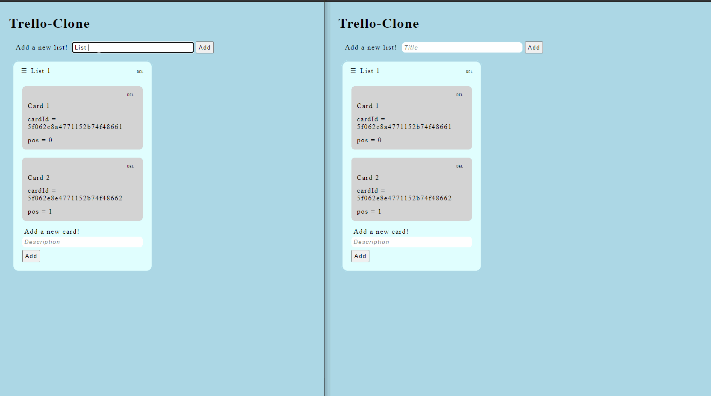

## Building a Trello Clone using React and GraphQL

This Repository demonstrates a simplified Trello Clone using React and GraphQL.

### Demo



### Features

- Add/Delete Lists and Cards
- Repositioning of Lists and Cards
- Trello like Drag and Drop with React Smooth Dnd
- Persistance tracking on lists' and card's position (will always remember it's placement)
- GraphQL Subscriptions enabled for real time cross-user collaboration

### Tech Stack

- NodeJS
- React
- Apollo
- Express
- GraphQL
- Mongoose
- MongoDB

### To Run the Application

Open two terminals

Terminal One

```
  cd server
  npm install
  node server
```

Terminal Two

```
  cd client
  npm install
  npm run start
```
